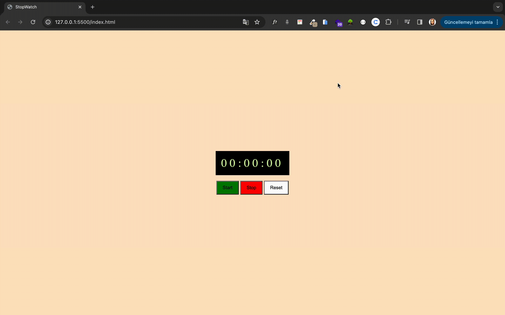

# Stopwatch Application

This simple stopwatch application allows you to measure time intervals in hours, minutes, and seconds. It features start, stop, and reset functionalities, making it a versatile tool for timing tasks, events, or exercises.

## Table of Contents

- [Technologies Used](#technologies-used)
- [Features](#features)
- [Screenshots](#Screenshots)

## Technologies Used

- HTML5
- CSS3
- Vanillia JavaScript

## Features

- Starting the Stopwatch: Click the Start button to begin timing. The stopwatch will display the elapsed time in hours, minutes, and seconds.- Display detailed weather information for each city, including temperature, description, and humidity.
- Stopping the Stopwatch: Click the Stop button to pause the timing. You can resume by clicking the Start button again.
- Resetting the Stopwatch: To clear the current time and reset the stopwatch, click the Reset button. This will set the time back to 0:00:00.

## Screenshots
 

[StopwatchApp Live Page](https://sedadiriker.github.io/Clarusway-BootCamp-/JAVASCR%C4%B0PT/stopwatch-application/)

Happy coding! :rocket: