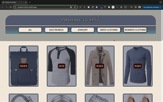

# Interactive Product List with Details Modal

Welcome to this interactive product list application, designed to provide a smooth browsing experience for a variety of items, with the added functionality of displaying detailed information in a modal upon clicking.


## Project Skeleton

```
Interactive-Product-List/
│
├── public/                       # Static files
│   └── index.html                # Main HTML file for the application
│
├── src/                          # Source files
│   ├── components/               # React components
│   │   ├── Header/               # Header component
│   │   │   ├── Header.jsx        # Header component JSX
│   │   │   └── Header.scss       # Header component styles
│   │   │
│   │   └── ProductCard/          # ProductCard component
│   │       ├── ProductCard.jsx   # ProductCard component JSX
│   │       └── ProductCard.scss  # ProductCard component styles
│   │
│   ├── helper/                   # Helper data
│   │   └── data.js               # Data file for products
│   │
│   ├── SCSS/                     # SCSS stylesheets
│   │   ├── _mixins.scss          # Mixins for reuse in multiple files
│   │   ├── _reset.scss           # Reset/normalize styles
│   │   └── _variables.scss       # Variables for styling (colors, fonts, etc.)
│   │
│   ├── App.js                    # Main React application component
│   ├── App.scss                  # Global styles for the application
│   └── index.js                  # React entry point
│
├── .gitignore                    # Specifies intentionally untracked files to ignore
├── package.json                  # Project manifest with dependencies, scripts, etc.
├── README.md                     # Project documentation and instructions


```
## Features

- Dynamic Product Filtering: Users can filter products by categories using the navigation bar, enhancing the browsing experience.
- Modal for Product Details: Clicking on a product card brings up a modal window with more detailed information, creating an intuitive user interaction without navigating away from the page.
- Responsive Design: Crafted with responsiveness in mind, the application provides an optimal viewing experience across a range of devices.

## Screenshots



[Product List Live Page](https://product-listss.netlify.app/)


## Description

In the project directory, you can run:
### `yarn install`
Before running the app, install the necessary dependencies with this command. It should be executed only once before you start the application for the first time or after updating the dependencies.

### `yarn start`
Runs the app in the development mode. Open http://localhost:3000 in your browser to view it. The page will reload if you make edits. 

### `yarn build`
Builds the app for production to the build folder. It correctly bundles React in production mode and optimizes the build for the best performance.


