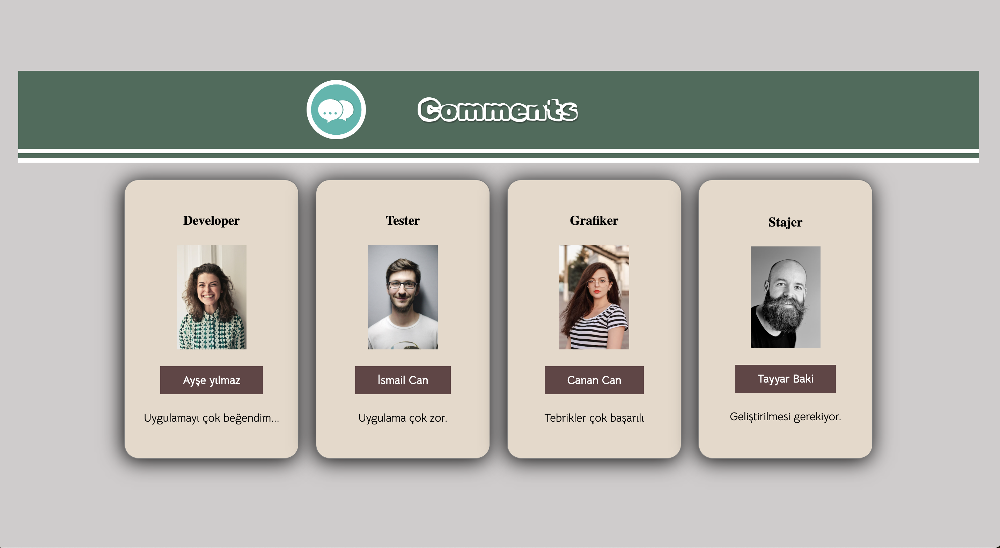

# Image Gallery
In this project, I developed a photo gallery web page using React at a basic level.

## Project Skeleton

```
Comments/
│
├── public/                        #  Static files
│   ├── images/                    #  Image files for the gallery
│   │   └── ...                    #  Images used in the gallery
│   └── index.html                 #  Main HTML file
│
├── src/                           #  Source files
│   ├── components/                #  React components
│   │   ├── Card.jsx               #  Component for displaying each image card
│   │
│   ├── helper/                    #  Helper functions
│   │   ├── data.js                #  Data file for the gallery images
│   │
│   ├── pages/                     #  Page components
│   │   ├── Homepage.jsx           #  Homepage component displaying the gallery
│   │
│   ├── styles/                    #  Stylesheets
│   │   ├── mixins.scss            #  Mixins for SASS
│   │   ├── variables.scss         #  SASS variables
│   │   ├── App.scss               #  Main stylesheet for the application
│   │   ├── Card.module.scss       #  Styles for the Card component
│   │   └── Homepage.module.scss   #  Styles specific to the Homepage
│   │
│   ├── App.js                     #  Main React application component
│   ├── index.js                   #  React entry point
│   └── ...
│
├── .gitignore                 
├── package.json               # Project manifest with dependencies, scripts, etc.
└── README.md                  # Documentation for the project

```
## Used Technologies and Libraries

- HTML
- SASS
- Module CSS
- React JS


## Screenshots



[Image Gallery Live Page](https://coommentss.netlify.app/)


## Description

In the project directory, you can run:
### `yarn install`
Before running the app, install the necessary dependencies with this command. It should be executed only once before you start the application for the first time or after updating the dependencies.

### `yarn start`
Runs the app in the development mode. Open http://localhost:3000 in your browser to view it. The page will reload if you make edits. 

### `yarn build`
Builds the app for production to the build folder. It correctly bundles React in production mode and optimizes the build for the best performance.


